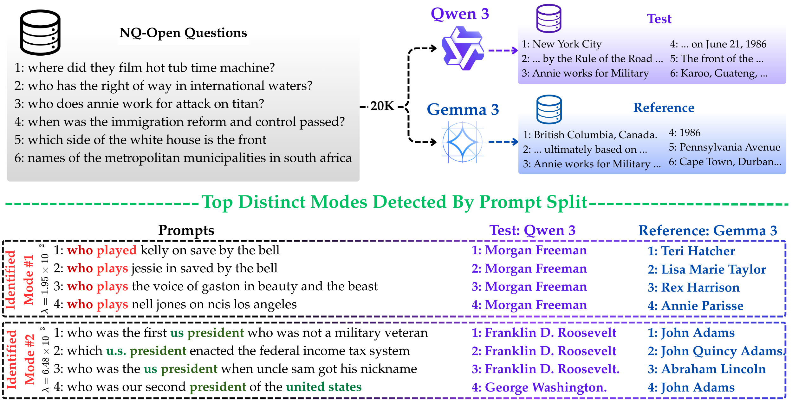

# PromptSplit: Revealing Prompt-Level Disagreement in Generative Models

This repository contains the official implementation and utilities for the paper:

**[PromptSplit: Revealing Prompt-Level Disagreement in Generative Models](https://arxiv.org/abs/2602.04009)**

## Overview

This project provides a unified framework for evaluating image and text embeddings using kernel-based methods and random projections. The codebase is organized for clarity and extensibility, supporting both image and text generation, embedding extraction, and advanced kernel-based analysis.

---

## Repository Structure

```
.
├── algorithm/
│   ├── random_projection.py   # Implements random projection methods
│   └── kernel_method.py       # Implements kernel-based methods
├── utils/
│   ├── ...                   # Scripts for image generation, text generation, and embedding extraction
├── README.md                 # Project documentation (this file)
└── ...
```

- **algorithm/**: Contains core algorithmic implementations:
  - `random_projection.py`: Dimensionality reduction and kernel approximation via random projections.
  - `kernel_method.py`: Kernel-based similarity and feature analysis methods.
- **utils/**: Utility scripts for:
  - Image generation
  - Text generation
  - Embedding extraction
  (Add your scripts here as needed.)

---

## Getting Started

1. **Clone the repository:**
   ```bash
   git clone https://github.com/your-username/unified-kernel-eval.git
   cd unified-kernel-eval
   ```

2. **Install dependencies:**
   - Python 3.8+
   - numpy

   You can use `pip` or `conda` to install requirements.

3. **Usage:**
   - See the scripts in `utils/` for data generation and embedding extraction.
   - Use the methods in `algorithm/` for kernel-based evaluation and analysis.

---

## Figure 1 (from the paper)




*Replace `./path_to_figure1.png` with the actual path to your figure image.*

---

## Citation

If you use this code or ideas from the paper, please cite:

```
@article{lotfian2026unified,
  title={Unified Kernel Evaluation of Image and Text Embeddings},
  author={Lotfian, [Your Name] and others},
  journal={arXiv preprint arXiv:2602.04009},
  year={2026}
}
```

---

## License

This repository is released under the MIT License. See [LICENSE](LICENSE) for details.

---

For questions or contributions, please open an issue or submit a pull request.
